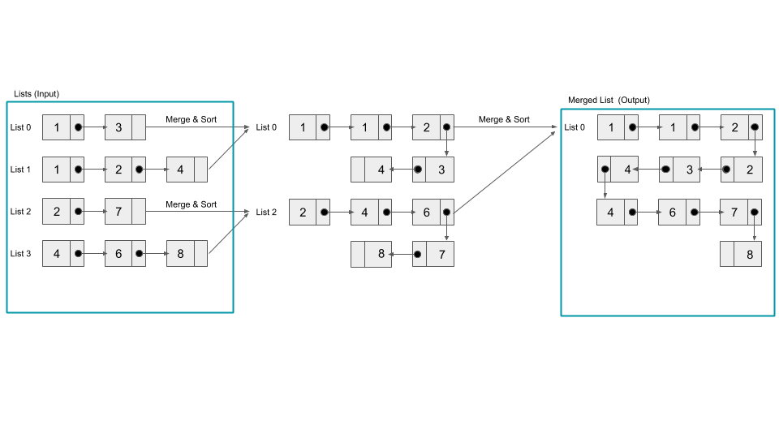

# Merge N Sorted Linked Lists

## Interviewer Prompt

Write a function that takes in the heads of N sorted Singly Linked Lists and return the merged list. The merged list should be in sorted order.

Each Linked List node has an integer value as well as a next node pointing to the next node in the list or to none / null if it is the tail of the list.

---

## Example Output

```javascript
Input =
[
  1->5->7,
  1->2->4->8,
  3->6->8
]

Output = 1->1->2->3->4->5->6->7->8->8
```

---

## Brute Force Approach

A naive approach would be to:

1. Iterate over all the linked lists in the input array and insert node values in an array
2. Sort this array in an ascending order
3. Initialize a new linked list and iterate over this sorted array and create a new node for each value and add it to the linked list
4. Return the merged list

## Brute Force Solution

```javascript
function ListNode(val) {
    this.val = val;
    this.next = null;
}

function mergeNLists(lists) {
    let nodes = [];
    for (let listsIdx = 0; listsIdx < lists.length; listsIdx++) {
        let currentList = lists[listsIdx];
        while (currentList !== null) {
            nodes.push(currentList.val);
            currentList = currentList.next;
        };
    }
    nodes.sort((a,b) => a - b);
    let mergedList = new ListNode(0);
    let currentNode = mergedList;
    for (let nodesIdx = 0; nodesIdx < nodes.length; nodesIdx++) {
        currentNode.next = new ListNode(nodes[nodesIdx]);
        currentNode = currentNode.next;
    }
    return mergedList.next;
};
```

##  Brute Force Solution Complexity Analysis

 n represents the total number of nodes in an input array.

### Time Complexity: O(n log n)

- Inserting all node values in an array takes O(n) time
- Sorting this array using sort() method takes O(n log n) time
- Generating the merged linked list by iterating over this sorted array takes O(n) time

### Space Complexity: O(n)

- Creating an array with all node values takes O(n) space
- Sorting this array using sort() method takes O(log n) space (click [here](https://blog.shovonhasan.com/time-space-complexity-of-array-sort-in-v8/) to learn more about time and space complexity of sort())
- Generating the merged linked list takes O(n) space

---

## Partially Optimized Approach by Min Heap

A partially optimized approach would be to:

1. Initialize a new min-heap that is stored as an array and has insert() and popMin() methods.
2. Add head nodes of all the linked lists to this min-heap which will compare and sort the node values such that the node value is not less than its parent’s. This comparison process will move the node with minimum value to the 0th index
3. Create a new linked list
4. Iterate over this min-heap which will accomplish the following:
	1. Remove the node with minimum value at the 0th index by using popMin()
	2. Create a new node with the value of the removed node and insert it to the new linked list.
	3. Add next of removed node to the min-heap
	4. Repeat steps 1 ~ 3 until min-heap is empty
5. Return the merged list

## Partially Optimized Solution

```javascript
class MinHeap {
    constructor() {
        this.heap = [];
        this.size = 0;
    }

    _swap (childIdx, parentIdx) {
        [this.heap[childIdx], this.heap[parentIdx]] =
      	[this.heap[parentIdx], this.heap[childIdx]];
    }

    _parentIdx (childIdx) {
        return Math.floor((childIdx - 1) / 2);
    }

    _childrenIndices (parentIdx) {
    	return [parentIdx * 2 + 1, parentIdx * 2 + 2];
    }

    insert (node) {
        this.heap.push(node);
	this.size++
    	this._heapifyUp();
    }

    _heapifyUp () {
        let currentIdx = this.heap.length - 1;
    	while (currentIdx > 0 &&
            this.heap[currentIdx].val <
            this.heap[this._parentIdx(currentIdx)].val) {
      	        this._swap(currentIdx, this._parentIdx(currentIdx));
     		currentIdx = this._parentIdx(currentIdx);
    	}
    }

    peek() {
        return this.heap[0].val;
    }

    popMin () {
        if (this.size === 1) {
            this.size--
            return this.heap.pop()
        }
    	const min = this.heap[0];
    	this.heap[0] = this.heap.pop();
	this.size--
	this._heapifyDown();
   	return min;
    }

    _heapifyDown () {
       let currentIdx = 0;
       let [left, right] = this._childrenIndices(currentIdx);
       let idxSmaller;
       const length = this.heap.length;
       while (left < length) {
           if (right < length) {
               idxSmaller = this.heap[left].val < this.heap[right].val ? left : right;
           }
           else {
               idxSmaller = left;
           }
           if (this.heap[currentIdx].val > this.heap[idxSmaller].val) {
               this._swap(idxSmaller, currentIdx);
               currentIdx = idxSmaller;
               [left, right] = this._childrenIndices(currentIdx);
            }
     	    else return;
        }
    }
}

function mergeNLists(lists) {
    let minHeap = new MinHeap()
    for (let listsIdx = 0; listsIdx < lists.length; listsIdx++) {
        let currentList = lists[listsIdx];
        if(currentList) {
            minHeap.insert(currentList);
        }
    }
    let mergedList = new ListNode(0);
    let currentNode = mergedList
    while(minHeap.size > 0) {
        let poppedNode = minHeap.popMin();
        currentNode.next = new ListNode(poppedNode.val);
        currentNode = currentNode.next;
        if(poppedNode.next) {
            minHeap.insert(poppedNode.next);
        }
    }
    return mergedList.next
}

```

##  Partially Optimized Solution Complexity Analysis

n represents the total number of nodes in an input array. <br />
N represents the total number of linked lists in an input array.

### Time Complexity: O(n log N)

- Inserting all linked lists in minHeap takes O(log N) time
- Generating the merged linked list until minHeap is empty takes O(n log N) time
	- Adding and removing all nodes in minHeap takes O(n) time
	- Comparison for every insert() and popMin() takes O(log N) time

### Space Complexity: O(n)

- Creating minHeap takes O(N) space (in-place method)
- Generating the merged linked list takes O(n) space

---

## Optimized Approach by Divide and Conquer

An optimized approach would be to:

1. Pair up N lists and merge each pair into a single sorted list
2. Pair up these sorted lists and merge each pair into a single sorted list
3. Repeat step 2 until one single sorted list of N linked lists is generated
4. Return the merged list

## Divide and Conquer Approach Diagram



## Optimized Solution

```javascript
function ListNode(val) {
    this.val = val;
    this.next = null;
}

function merge2Lists(list1, list2) {
    let mergedList = new ListNode(0)

    let curr = mergedList
    while (list1 !== null && list2 !== null) {
        if(list1.val <= list2.val) {
            curr.next = list1
            list1 = list1.next
        } else {
            curr.next = list2
            list2 = list2.next
        }
        curr = curr.next
    }
    curr.next = list1 !== null? list1 : list2
    return mergedList.next
}


function mergeNLists(lists) {
    if(lists.length === 0) {
        return null
    }
    let interval = 1
    while (lists.length > interval) {
        let idx = 0;
        while (idx + interval < lists.length) {
            lists[idx] = merge2Lists(lists[idx], lists[idx + interval])
            idx += interval * 2
        }
    	interval *= 2
    }
    return lists[0]
}
```

## Optimized Solution Complexity Analysis

n represents the total number of nodes in an input array. <br />
N represents the total number of linked lists in an input array.

### Time Complexity: O(n log N)
- Outer while loop which runs until one merged list is created takes O(log N) time
- Processing all nodes in N linked lists takes O(n) time

### Space Complexity: O(1)

- Merging N sorted linked lists takes O(1) space

---

## References

- [Leetcode Solution](https://leetcode.com/problems/merge-two-sorted-lists/solution/) (Leetcode Premium is needed to access the solution)
